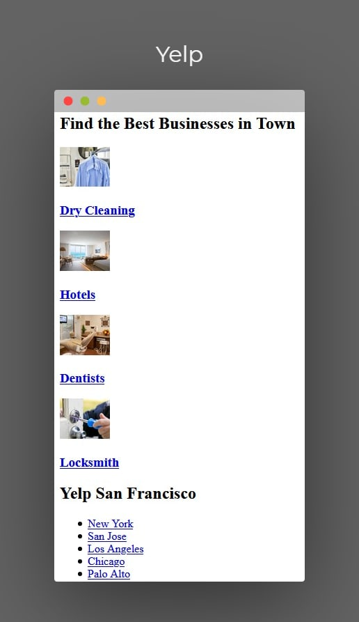
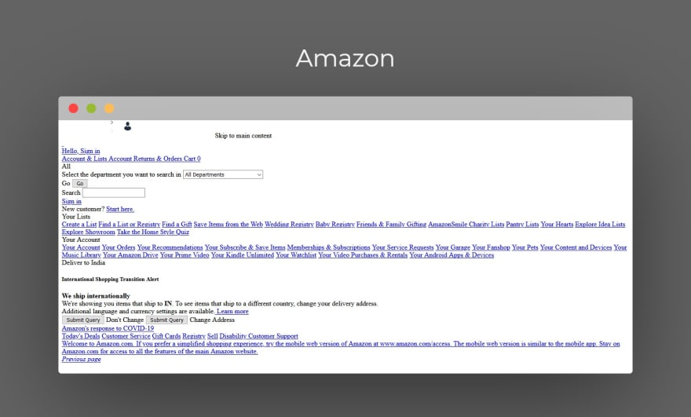
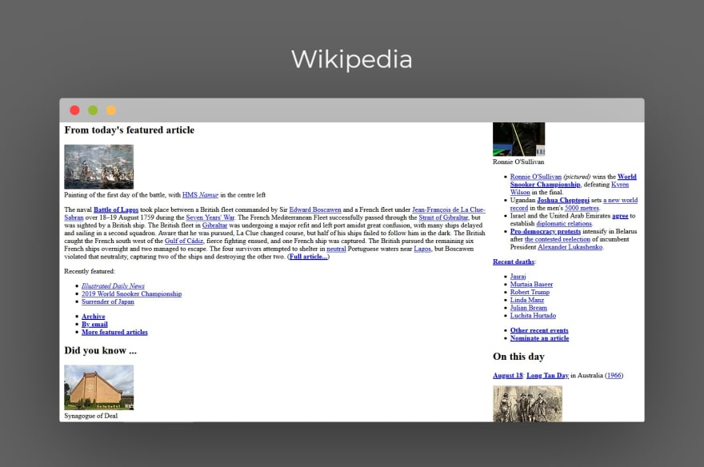

# CSS, Design, and Design Libraries

1. [Context](#context)
2. [Objectives](#objectives)
3. [Setup](#setup)
4. [Launch](#launch)
5. [The Lesson](#the-lesson)
6. [Extensions](#extensions)
6. [Related Resources](#related-resources)

## Context
### Time to Get Stylish

Students have been introduced to the basics of CSS and may have been using it already; this is a time to really deep dive into discussing the choices they are making in their CSS styling and to review important concepts within CSS. This is also a time for students to begin familiarizing themselves with some of the style requirements of Google and to become acquainted with the idea that big companies will have style guides, generally.

### Utilizing CSS Libraries/Frameworks
One thing that students will quickly notice is that styling - and making everything match and look nice and intentionally designed and cohesive - can be a time-consuming and tiring process. For this reason, there are _many_ CSS frameworks floating around the world that have either taken on a bulk of the styling work, or simplified some of the common needs, so that we don't have to. It's important that students understand that they do not need to become experts on every library (or any library for that matter), but they should understand the basics of why they exist and how to use them.


## Objectives

* SW write basic element, class, and ID-level selectors in CSS
* SW learn basic CSS properties most useful in design, like background-color, font-size, font-family, margin, padding, and line-height
* SW learn to read the Google HTML and CSS style guide, and write code compliant to that guide

## Setup

Decide which environment you want students to use for this activity, and prepare your sample code in that environment. While the majority of this course will be taught in Google Cloud Shell or in a local IDE, it is recommended that for ease of setup, this first week is taught in a ready-to-use cloud-based IDE that is optimized for HTML. Repl.it and Glitch are the two environments that make distributing code snippets to students the easiest - simply share the link to your workspace, and show students how to remix or clone the workspace you share.

To set up this lesson, you only need an index.html file and a linked style.css file. The CSS file should be blank, and the index.html file should contain the following code:

```html
<!DOCTYPE html>
<html>
<head>
    <meta charset="UTF-8">
    <title>All My Favorites</title>
    <link rel="stylesheet" href="style.css" type="text/css">
</head>
<body>
  <!--replace with your favorites-->
    <div> <h1>Favorite Foods</h1> </div>
    <div> <p>Sushi</p> </div>
    <div> <p>Garlic Naan</p> </div>
    <div> <p>Pizza</p> </div>

    <div><h1>Favorite Books</h1></div>
    <div><p>We Ride Upon Sticks</p></div>
    <div><p>Several People Are Typing</p></div>
    <div><p>The Last Graduate</p></div>

    <div><h1>Favorite Shows</h1></div>
    <div><p>We Are Lady Parts</p></div>
    <div><p>Stranger Things</p></div>
    <div><p>Bob's Burgers</p></div>
</body>
</html>
```

Ask students to fill in their favorites as they are getting started!

## Launch

Today is all about CSS and setting the stage for why we need it. So to start, let's look at some **top** websites and what they look like with their CSS removed (credit to this delightful article: https://dev.to/vaibhavkhulbe/the-web-without-css-18d)





If students would like to explore further, they can look for a Chrome Extension that will allow them to turn the CSS off on webpages, but it's not required. These images should be enough to realize that CSS is important - really important! But just as we want to make sure we use CSS to make our HTML more readable, we want to make sure we use these powers wisely - too much of a good thing can be, in fact, a very very bad thing, as demonstrated by this site that you should absolutely show to students and allow them to explore: https://badhtml.com/

Explain to students that we want to use CSS to enhance our pages without going overboard so that they become unreadable because they are _too_ styled.

## The Lesson

### Planning for Classes && IDs (Review)

When students start styling, the first two things they will want to do are making sure they have a plan for the design, and identifying what elements of their design will share common features. These repeated elements will often be utilizing classes or IDs - classes are for elements that will repeat, and IDs are for elements that will be unique (read: you will not want to repeat the call to that specific styling anywhere else on the page).

Ask students to take the starter code and do a quick sketch (on paper or a tool like Jamboard, Google Drawings, etc) to map out what they want this site to look like. This is really all about them, so you do not need to force them into all having one design that is the same. Encourage students to start adding in the classes and IDs to their code so they are there to style later, and ensure students are aware that each element can have multiple classes and an ID if it's helpful.

```html
<html>
<head>
    <meta charset="UTF-8">
    <title>All My Favorites</title>
    <link rel="stylesheet" href="style.css" type="text/css">
</head>
<body>
  <!--replace with your favorites-->
    <div class="favs food"> <h1 class="heading">Favorite Foods</h1> </div>
    <div class="favs food"> <p>Sushi</p> </div>
    <div class="favs food"> <p>Garlic Naan</p> </div>
    <div class="favs food"> <p>Pizza</p> </div>

    <div class="favs books"><h1 class="heading">Favorite Books</h1></div>
    <div class="favs books"><p>We Ride Upon Sticks</p></div>
    <div class="favs books"><p>Several People Are Typing</p></div>
    <div class="favs books"><p>The Last Graduate</p></div>

    <div class="favs shows"><h1 class="heading">Favorite Shows</h1></div>
    <div class="favs shows"><p>We Are Lady Parts</p></div>
    <div class="favs shows"><p>Stranger Things</p></div>
    <div class="favs shows"><p>Bob's Burgers</p></div>
</body>
</html>
```
In this example, each div has two classes - one called 'favs' that is something that unites every div on the page (this could, theoretically, be left out and all divs could be styled generally, but it's here for the sake of the example) but 'food' or 'books' are classes that separate each category of favorites.

#### Helpful Questions
* Why would use a class instead of an ID?
* How are classes/IDs helpful in styling?

### The Most Important CSS

There is so much CSS out there and it can be tempting for students to go crazy styling with text-shadow and a bazillion other oddities that seem cool, but aren't really helpful. Explain to students that the things that will give them the most leverage are styling attributes such as:

* background-color
* font-size
* font-family
* margin
* padding
* line-height

As students start planning, the things that can be most confusing are margin and padding (and borders) when styling divs. An easy way to explain is that padding is what goes around the contents INSIDE the div (like padding in a shipping box) and margins are what keep the outer edge of the div away from other elements on the page (like the distance a shipping box is from other shipping containers). Walk students through styling a class or element on their page - this is purely an example and students should have lots of freedom to adjust these styles based on their own preferences, and to explore resources like W3 Schools if there are other things they want to learn about.

```css
.fav{
  font-size: 12px;
  font-family: 'Roboto', sans-serif;
  margin: 5px;
  padding: 10px;
}

.books{
  background-color: #57A0D9;
}
```

When discussing fonts, ensure students understand that fonts need to be linked in the head of their HTML to make sure they show up correctly in all browsers. Fonts and colors are full of subtle design decisions, and for students who may need assistance making good choices, they can reference:

* [Aesop's Fables with Google Fonts](https://femmebot.github.io/google-type/) - a design exercise that shows font pairings from Google Fonts using Aesop's Fables
* [Adobe Color Picker](https://color.adobe.com/create) - can assist in selecting palettes with certain color designations

Allow students about 10-15 minutes to just focus on styling their page based on the classes/IDs they set up in the first section.

#### Helpful Questions
* What dangers can you run into when choosing colors/fonts?
* Why might you want to limit some of the style choices you are making?

### Google Style Guide

By now, students should notice that they've written _a lot_ of code and it could be getting messy or difficult to read. If they look at their neighbor, there may also be differences in how their neighbor has been writing or commenting their code. Explain that this is a common issue, and big companies like Google want to make sure everyone is on the same page so that when they eventually are collaborating, everyone is working to the same standard and seeing something familiar.

Allow students ~5 minutes to look over the Google standards, and then focus in on just a few that are high leverage in this moment:

* Indentation (two spaces!)
* Capitalization in HTML - there shouldn't be any
* Comments - they gotta leave some so other people know what they were thinking!
* All things general formatting, like using only single quotations, grouping CSS with comments, declaring CSS attributes in alphabetical order, etc.

Then, give students another 5-10 minutes to try to edit their work to meet Google Standards. Something like the initial code shown might start looking more like this:

```html
<!-- section on favorite foods -->
<div class="favs food">
  <h1 class="heading">Favorite Foods</h1>
</div>

<!-- each food in its own div -->
<!-- TODO: add descriptions and images -->
<div class="favs food">
  <p>Sushi</p>
</div>

<div class="favs food">
  <p>Garlic Naan</p>
</div>

<div class="favs food">
  <p>Pizza</p>
</div>
```

#### Helpful Questions
* Why is it important to practice these standards now?
* How can they strategize to ensure their code meets these standards?

### All About CSS Frameworks/Libraries

We've covered a lot, and students may be feeling overwhelmed about how to juggle all of this to make professional, polished looking websites every time. That's to be expected - and they're not alone! People have struggled long before them and have come up with solutions to allow for people to build good looking websites quickly and without having to recode all of these best practice things over and over and over.

Enter CSS Frameworks (sometimes referred to as libraries) which are essentially collections of CSS classes and other styled elements that have been created so that all you, the programmer, needs to do is connect it to your HTML and get coding. Introduce students to **Materialize** and explain that for a quick start, they can just use the CDN by sticking this code in the head of their HTML page:

```html
<!-- Compiled and minified CSS -->
    <link rel="stylesheet" href="https://cdnjs.cloudflare.com/ajax/libs/materialize/1.0.0/css/materialize.min.css">

    <!-- Compiled and minified JavaScript -->
    <script src="https://cdnjs.cloudflare.com/ajax/libs/materialize/1.0.0/js/materialize.min.js"></script>          
```

From there, go over the basics of Materialize: the documentation explains what exists inside the library for them to use in styling their webpages, as long as they've linked everything together. Walk students through adding a few of the classes and perhaps starting to look at the grid system, which they will likely need the most time with.

**Once students are introduced to this idea, they will really have open work time to play and become competent with the ideas of the lesson. This can either happen in the initial starter code OR in their mini project homework.**

#### Helpful Questions
* How can existing CSS frameworks help you to style webpages quickly?

Repeat the topic-codeblock-questions loop as many times as needed to create the lesson.

## Extensions

Extensions are generally presented in order of difficulty, and should be offered to students with that caveat in mind. It's not critical that students do these activities specifically, but these are a good starting place.

* Utilize the CSS colors to differentiate all of the divs on your page.
* Use the grid system in Materialize to organize your page so div elements are next to each other. (You might want to add a little more content so you have more to style/move around!)
* Try to add several components from materialize, such as buttons, a nav bar, or a footer.
* Experiment with the JavaScript side of Materialize and try adding a collapsible component somewhere on your page.
* Review several other CSS libraries. Duplicate your code and see if you can recreate your page using a different framework and decide which you like more.

## Related Resources

* [Google's Front End Style Guide](https://google.github.io/styleguide/htmlcssguide.html) - Large companies like Google have style guides to make sure code and its output are uniform. Do your best to follow these guidelines as you are coding and styling!
* [w3Schools CSS Tutorials](https://www.w3schools.com/css/default.asp) - written intro to CSS

###CSS Libraries/Frameworks
* [Materialize](https://materializecss.com/) - open source CSS framework developed by Google
* [Bootstrap](https://getbootstrap.com/) - popular CSS framework
* [Bulma](https://bulma.io/) - a great alternative to Bootstrap
* [Tailwind CSS](https://tailwindcss.com/) - lightweight CSS framework offering lots of freedom
* [Milligram](https://milligram.io/) - minimalist CSS framework
* [Pure CSS](https://purecss.io/) - micro CSS framework with responsive modules

_Note: There are **so** many CSS frameworks out there! If you're interested in exploring others, do a quick Google search to see what else pops up._
