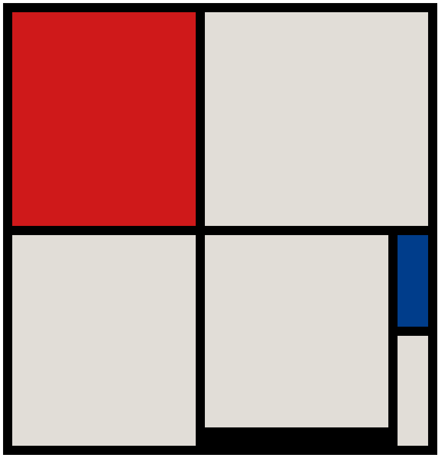
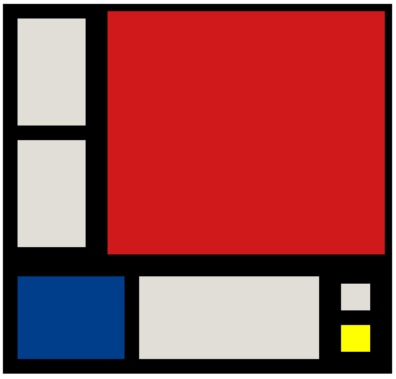
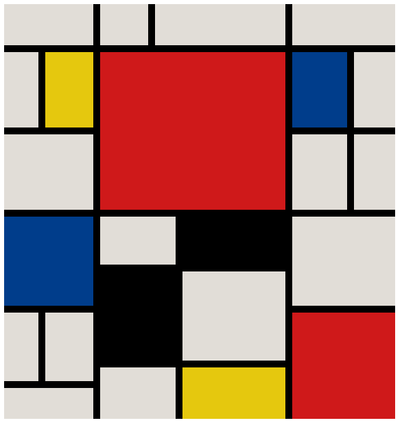
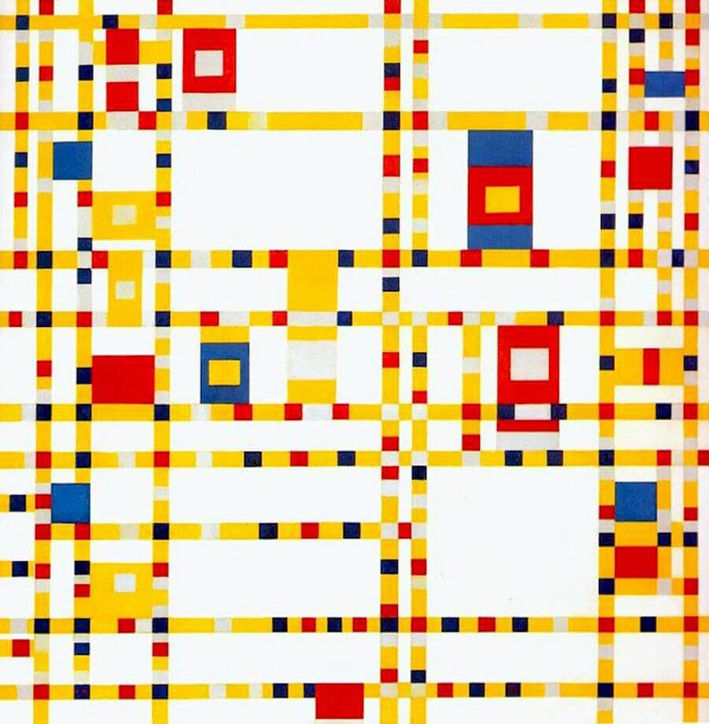

# HTML Art Museum

## Objectives

Core Objectives:
* Practice nesting HTML elements inside of other HTML elements
* Write HTML attributes like `class` and `id` with correct syntax

Secondary Objectives
* See some interesting styling in action
* Automate or expedite a repetitive task using code or creative problem solving

**Core requirement:** Complete at least two of the five challenges listed below. While they are generally in order of ascending difficulty, you are not required to attempt them in order.

## Context

In this lab, you've been hired by a legendary digital geometric artist named Izabella Lopez-Garcia to bring some of her artistic visions to light. She's inspired by the Dutch painter Piet Mondrian, and enjoys creating digital pieces that hearken back to and emulate Mondrian's work.

She's done a lot of the work - she's written a _ton_ of CSS code to generate some digital masterpieces, but she doesn't have time to write all the corresponding HTML. She's brought you on as a protege to finish the HTML so that she can focus on other projects. 

Izabella writes her plan for HTML in shorthand, and it's a little tricky to pick up at first, but here's how she does it:
* If she writes `p` in her notes, she is asking you to write a paragraph element: `<p></p>`. The same goes for any other element, so if she asks for a `section`, that should become a `<section></section>`.
* Izabella denotes an HTML class with a period, so if she asks for a `div.cool` that means she wants a div with a class of cool: `<div class="cool"></div>`. She'll chain these notes together for elements with multiple classes, so `div.cool.smart` would mean she wants `<div class="cool smart"></div>`.
* She denotes an HTML ID with a `#` symbol, so if she asks for a `h1#title` that means she wants `<h1 id="title"></h1>`
* Lastly, if an element is indented underneath another element, that means she wants the indented element INSIDE that other element. 

That might be a lot to process, so here's what that looks like. Assume that Izabella asks you to write out this:

```
section#main.shadow
    div.small.narrow
```

She's asking for the following HTML:
```html
<section id="main" class="shadow">
    <div class="small narrow"></div>
</section>
```

## The Setup

Clone or import this lab to the coding environment of your choice. 

Then, open up `painting1.html` in your editor. You'll also want to open the preview in your browser. If you're using a cloud-based IDE, use the built-in preview function. If you're working locally, right click on the file, click "copy path" or "copy file location" and paste it into Chrome to see the art unfold. Don't worry if it's mostly blank when you first open it up. 

Read on for Izabella's instructions.

## The Lab

### Painting 1:

Open up `painting1.html` and add the following html inside the `painting1` div. 

```
div#primary
div.blank#double
div.blank.tall
div.blank.tall.heavy
div.small#navy
div.small
```

You'll know you've succeeded if your painting looks like this when opened in Chrome:


### Painting 2:

Open up `painting2.html` and add the following html inside the `painting2` div. 

```
div.left-col
    div.pale
    div.pale
div#giant.rosy
div.bottom-row
    div.powerful
    div#wider
    div#right-col
        div#the-yellow-one
        div
```

You'll know you've succeeded if your painting looks like this when opened in Chrome:


### Painting 3:

Open up `painting3.html` and add the following html inside the `painting3` div. 

Please note that the spaces here don't signal anything special other than that they are good places to skip a line in your code and add a comment, like `<!-- group 1 -->` or similar to help you keep your code nice and tidy.

```
div.wide
div
div.wide
div.wide

div
div.glow
div.rosy.tall.triple-wide
div.royal
div

div.wide
div
div

div.royal.giant
div.wide
div.dark
div.giant

div.giant.dark
div.tall

div.tall
div.tall
div#biggest-red

div.giant
div.glow.tall
div.wide
```

You'll know you've succeeded if your painting looks like this when opened in Chrome:


### Painting 4

Open up `painting4.html` and add the following html inside the `painting3` div. 

By this point you may have noticed that this process feels a little tedious. As a stretch activity, you might see if you can figure out a way to speed this up. It could be as simple as a find-and-replace feature in your text editor, something as complicated as a Python script, or something as clever as an existing tool that you find. 

If you choose to look for a way to speed this up, it's ultimately up to you how you choose to do so. Good luck!

```
div.broadway-row#row1
    div
    div.yellow
    div
    div.red
    div.double

    div.yellow
    div.quad
    div.red
    div.quad
    div.quad

    div.quad
    div.red
    div
    div.yellow
    div.quad

    div.quad
    div.double
    div.yellow
    div
    div.red
    
    div
    div.yellow
    div
    div.red
    div

div.broadway-row#row2
    div.yellow
    div.blue
    div.double.yellow
    div.quad.yellow
    div.blue

    div.yellow
    div.grey
    div.quad.yellow
    div.grey
    div.quad.yellow

    div.triple.yellow
    div.grey
    div.yellow
    div.grey
    div.yellow

    div.grey
    div.quad.yellow
    div.grey
    div.triple.yellow
    div.grey

    div.blue
    div.yellow
    div.grey
    div.yellow
    div.blue

    div.grey
    div.yellow
    div.grey
```


You'll know you've succeeded if your painting looks like this when opened in Chrome:


### Stretch: Finish the Broadway Boogie-Woogie

Izabella's fourth digital painting is a recreation of Mondrian's Broadway Boogie-Woogie. Unfortuntaely t's clear that it isn't finished yet. In fact, Izabella only gave instructions for two rows of the painting but it looks like it could use another 40 or so. 

See if you can finish the painting using the photo below as a reference. Good luck!

